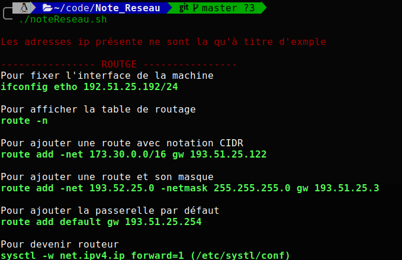

# Commande utiles la gesetion d'un reseau sous linux

Petit dépôt pour lister les commandes utiles.

```
git clone https://github.com/Kagarie/Note_Reseau.git
```

Installation

```BASH
cd Note_symfony
./install.sh
```
Plus qu'a reboot votre Terminal pour l'utiliser.

Utilisation 
```BASH
note
```

Aperçu :




